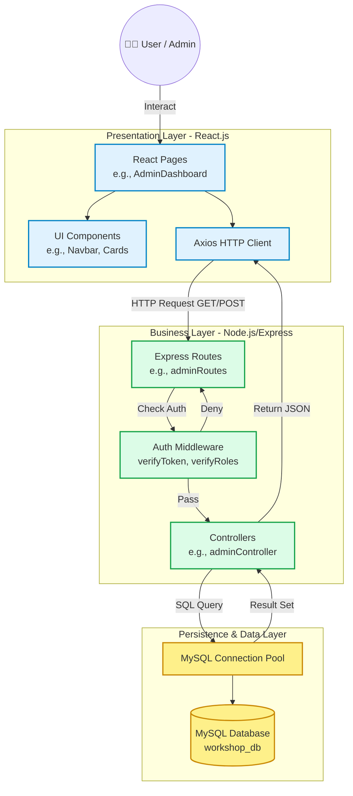

# D2: Component Diagrams & Code Skeleton

เอกสารฉบับนี้แสดงภาพรวมของคอมโพเนนต์ต่างๆ ในระบบ (Component Diagram) ความสัมพันธ์ระหว่างส่วนต่างๆ รวมถึงโครงสร้างของซอร์สโค้ด (Code Skeleton) ที่ใช้ในการพัฒนา Workshop Management System

---

## 1. Component Diagram (แผนภาพคอมโพเนนต์)

แผนภาพด้านล่างแสดงให้เห็นถึงการไหลของข้อมูล (Data Flow) และความสัมพันธ์ระหว่าง Frontend, Backend และ Database ตั้งแต่ผู้ใช้งานกดหน้าเว็บ ไปจนถึงการดึงข้อมูลจากฐานข้อมูล


## 2. Code Skeleton (โครงสร้างซอร์สโค้ด)

โครงสร้างโฟลเดอร์ของโปรเจกต์ถูกออกแบบตามหลักการ **Separation of Concerns** โดยแยกส่วน Frontend และ Backend ออกจากกันอย่างชัดเจน รวมถึงการแบ่ง Layer ภายในให้เป็นระเบียบ ดังนี้:

### โครงสร้างรวมของโปรเจกต์ (Project Directory)
```text
Workshop-Management-System/
Workshop-Management-System/
├── .github/                    # ตั้งค่า CI/CD Automated Testing (GitHub Actions)
├── docs/                       # เอกสาร System Design Document (D2 และ D3)
├── frontend/                   # Presentation Layer (React + Vite)
│   ├── public/                 # ไฟล์ Static ทั่วไปที่ไม่ได้ผ่านการ Build
│   ├── src/
│   │   ├── assets/             # รูปภาพ, ไอคอน และไฟล์ Static ต่างๆ
│   │   ├── components/         # Reusable UI Components (เช่น Navbar.jsx, ProtectedRoute.jsx)
│   │   ├── pages/              # หน้าจอหลักของระบบ (เช่น AdminDashboard, HomePage, ManageUsers)
│   │   ├── App.jsx             # จุดจัดการเส้นทาง (Routing Component) ของหน้าบ้าน
│   │   ├── main.jsx            # จุดเริ่มต้นการทำงานของ React (Entry Point)
│   │   └── App.css / index.css # ไฟล์จัดการ Stylesheet หลัก (Tailwind)
│   ├── .env                    # ตัวแปรสภาพแวดล้อมฝั่งหน้าบ้าน (เช่น API_URL)
│   ├── eslint.config.js        # ตั้งค่า Linter สำหรับตรวจจับข้อผิดพลาดในโค้ด
│   ├── index.html              # ไฟล์ HTML หลักที่แสดงผลเบราว์เซอร์
│   ├── package.json            # รายการ Dependencies และ Scripts ของ Frontend
│   └── vite.config.js          # ตั้งค่าเครื่องมือ Vite Bundler
└── backend/                    # Business & Persistence Layer (Node.js + Express)
    ├── database/               # สคริปต์ที่เกี่ยวข้องกับฐานข้อมูล (เช่น ไฟล์ .sql)
    ├── src/
    │   ├── config/             # ตั้งค่า Database Connection Pool (db.config.js)
    │   ├── controllers/        # รับ Request ประมวลผล และส่ง Response กลับ (MVC Controller)
    │   ├── middleware/         # Cross-cutting Logic ควบคุมสิทธิ์ (authMiddleware.js)
    │   ├── repositories/       # จัดการคำสั่ง SQL โต้ตอบกับ DB โดยตรง (Repository Pattern)
    │   ├── routes/             # จัดการเส้นทาง API Endpoints
    │   ├── services/           # จัดการ Business Logic ที่มีความซับซ้อนสูง
    │   └── utils/              # กล่องเครื่องมือเก็บ Helper Functions อเนกประสงค์
    ├── tests/                  # โค้ดสำหรับทำ Automated Testing (Unit & Integration Tests)
    ├── .env                    # ตัวแปรสภาพแวดล้อมฝั่งหลังบ้าน (เช่น JWT_SECRET, DB_PASS)
    ├── package.json            # รายการ Dependencies และ Scripts ของ Backend
    └── server.js               # จุดเริ่มต้นการทำงานของ Backend Server
```

### คำอธิบายคลาสและอินเทอร์เฟซหลัก (Class Definitions & Interfaces)

เนื่องจากโปรเจกต์ใช้ JavaScript (Functional & Class-based approach) การนิยามโครงสร้างหลักจะเป็นในรูปแบบของ Module และ Controller Classes ดังนี้:

* **`Controllers` (Class / Module):**
  * รวบรวมฟังก์ชันสำหรับจัดการข้อมูลและ Business Logic เช่น `AdminController` สำหรับจัดการสิทธิ์และสถิติ, `WorkshopController` สำหรับจัดการ CRUD ของกิจกรรม
* **`Repositories` & `Services`:**
  * แยกส่วนการเขียนคำสั่ง SQL ออกจาก Controller เพื่อให้ดูแลรักษาง่ายและลดความซ้ำซ้อน (ตามหลัก Repository Pattern)
* **`Utils` (Helper Functions):**
  * ฟังก์ชันช่วยเหลือย่อยที่ถูกแยกออกมาเพื่อนำไปใช้ซ้ำในหลายๆ Controller (เช่น ฟังก์ชันตรวจสอบรูปแบบข้อมูล, การคำนวณตัวเลข)
* **`Tests` (Testing Suites):**
  * ชุดทดสอบระบบอัตโนมัติที่ทำงานร่วมกับไลบรารี Jest และ Supertest เพื่อตรวจสอบความถูกต้องของฟังก์ชัน (Unit Test) และการตอบสนองของ API (Integration Test)
* **`authMiddleware` (Functions):**
  * `verifyToken(req, res, next)`: ฟังก์ชันถอดรหัส JWT (JSON Web Token) เพื่อยืนยันตัวตนของผู้ใช้
  * `verifyRoles(...allowedRoles)`: คืนค่าเป็น Middleware Function เพื่อตรวจสอบสิทธิ์การเข้าถึงแบบ RBAC (Role-Based Access Control)
* **`React Pages & Components` (Functional Components):**
  * คืนค่า (Return) เป็น JSX เพื่อ Render หน้าจอฝั่ง Client โดยจัดการ State ภายในด้วย `useState` และควบคุมวงจรชีวิต/Side effects ของคอมโพเนนต์ด้วย `useEffect`